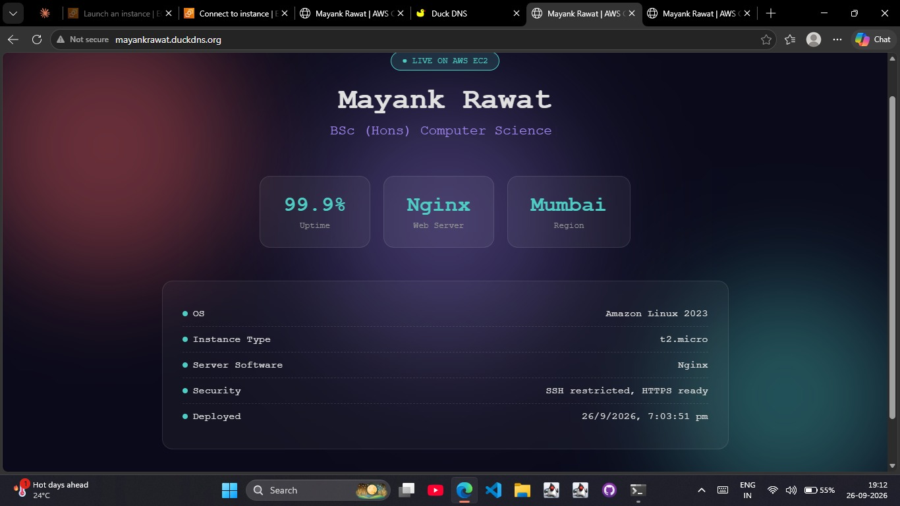
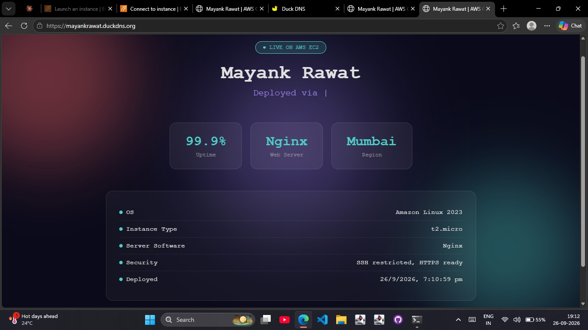

# Mayank Rawat — Portfolio Deployment on AWS EC2 (HTTP & HTTPS)

This project documents deploying a personal portfolio website on an AWS EC2 instance in two configurations — **HTTP (insecure)** and **HTTPS (secure)** — to understand and compare how each works. The instance was later terminated after the demonstration was complete.

## 📋 Deployment Details

| Setting | Value |
|---|---|
| OS | Amazon Linux 2023 |
| Instance Type | t2.micro |
| Web Server | Nginx |
| Region | Mumbai (ap-south-1) |
| Domain | DuckDNS (mayankrawat.duckdns.org) |
| Security | SSH restricted, HTTPS enabled |

---

## 📖 Theory: How the Deployment Works

**EC2 (Elastic Compute Cloud)**
A virtual server on AWS. You "rent" a machine (here, t2.micro — a free-tier eligible instance) and install whatever software you need on it, like a normal computer.

**Security Group**
Acts as a virtual firewall attached to the EC2 instance. It controls which ports are open to incoming traffic from the internet (e.g. port 22 for SSH, port 80 for HTTP, port 443 for HTTPS). By default everything is blocked — you explicitly allow only what's needed.

**Nginx**
A web server software that listens for incoming HTTP/HTTPS requests and serves the website's files to visitors' browsers.

**DuckDNS**
A free dynamic DNS service. Instead of visitors typing a hard-to-remember IP address, DuckDNS maps a human-readable domain (mayankrawat.duckdns.org) to the EC2 instance's public IP.

**SSH restricted**
Port 22 (used to remotely log into the server) was limited to a specific IP rather than being open to everyone — reduces the attack surface for brute-force login attempts.

---

## 🔓 Step 1: Insecure Deployment (HTTP)

**What was done:**
- Installed Nginx on the EC2 instance
- Opened port 80 in the Security Group (inbound rule: HTTP, source 0.0.0.0/0)
- Site was accessible via http://mayankrawat.duckdns.org

**Theory — why it's "insecure":**
HTTP sends data in plain text between the browser and server. Anyone intercepting the traffic (e.g. on a shared network) can read it. Browsers flag such sites with a "Not Secure" warning. There is no verification that the server is who it claims to be.

**Screenshot:**





---

## 🔒 Step 2: Secure Deployment (HTTPS)

**What was done:**
- Obtained an SSL/TLS certificate via Let's Encrypt (Certbot) for the DuckDNS domain
- Opened port 443 in the Security Group (inbound rule: HTTPS, source 0.0.0.0/0)
- Site was accessible via https://mayankrawat.duckdns.org

**Theory — why it's "secure":**
HTTPS = HTTP + TLS encryption. The certificate encrypts data between browser and server, so intercepted traffic is unreadable. It also verifies the server's identity via a trusted Certificate Authority (here, Let's Encrypt), which is why browsers show a padlock instead of a warning.

**Screenshot:**





---

## ⚖️ Summary: HTTP vs HTTPS

| Aspect | HTTP (Insecure) | HTTPS (Secure) |
|---|---|---|
| Port | 80 | 443 |
| Encryption | None | TLS/SSL encrypted |
| Certificate needed | No | Yes |
| Browser indicator | "Not Secure" warning | Padlock icon |
| Use case | Testing/learning only | Production websites |

## 🔑 Key Takeaways
- Security Groups should only open the ports actually in use — minimize the attack surface
- Plain HTTP should never be used for anything handling sensitive data
- Free SSL certificates (Let's Encrypt) make HTTPS accessible even for personal/small projects
- The EC2 instance used here was terminated after this demonstration to avoid ongoing charges

## ⚙️ How to Reproduce

```bash
sudo dnf update -y
sudo dnf install nginx -y
sudo systemctl start nginx
sudo systemctl enable nginx
 
Point a free DuckDNS domain to the EC2 public IP (sign up at duckdns.org, create a subdomain, update it to the instance's IP)

For HTTPS with Certbot (requires the domain to already resolve):

sudo dnf install certbot python3-certbot-nginx -y
sudo certbot --nginx -d mayankrawat.duckdns.org

🛠️ Tech Stack
AWS EC2 (Amazon Linux 2023)
Nginx
DuckDNS (domain)
Let's Encrypt (Certbot) for SSL
